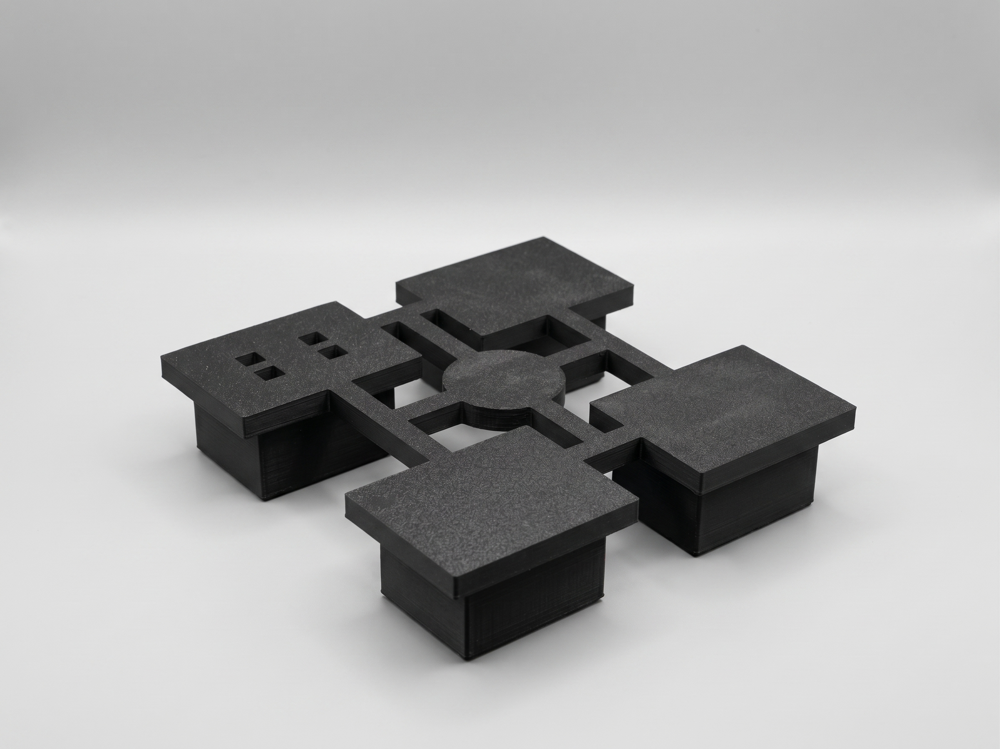

# Anti Vibration Legs For 3D-Printers
This project is designed to provide a solution for dampening the low-frequency vibrations produced by 3D printers during operation without the use of professional rubber parts.

## Versions  
### V1 | Basic Start Model  
  
  
  **Description:** This model is the first product based on this idea.  
  **Errors:** Structural vibration and stability issues in the printer housing.   
  **Results:** A noticeable decrease in low-frequency vibration transmission.  
  **Time Spent For Modelling** 3 Hours  
  **Model Documentation** [Version V1](https://github.com)  
  **See On Makerworld** [Vertsion V1](https://makerworld.com/de/models/3269884-ultimate-anti-vibration-feet-for-low-frequency#profileId-3707620)  
